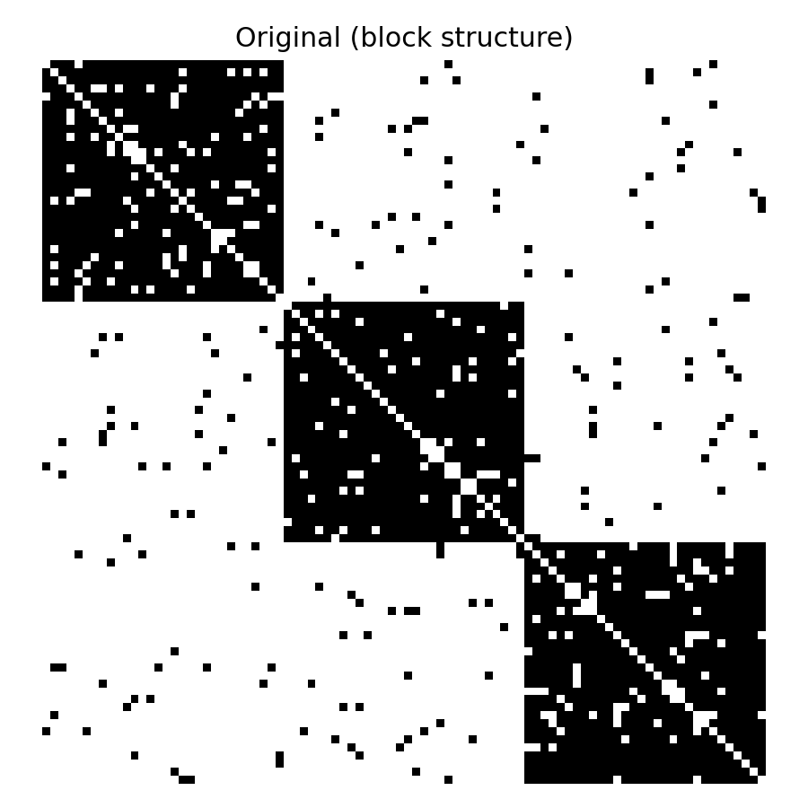
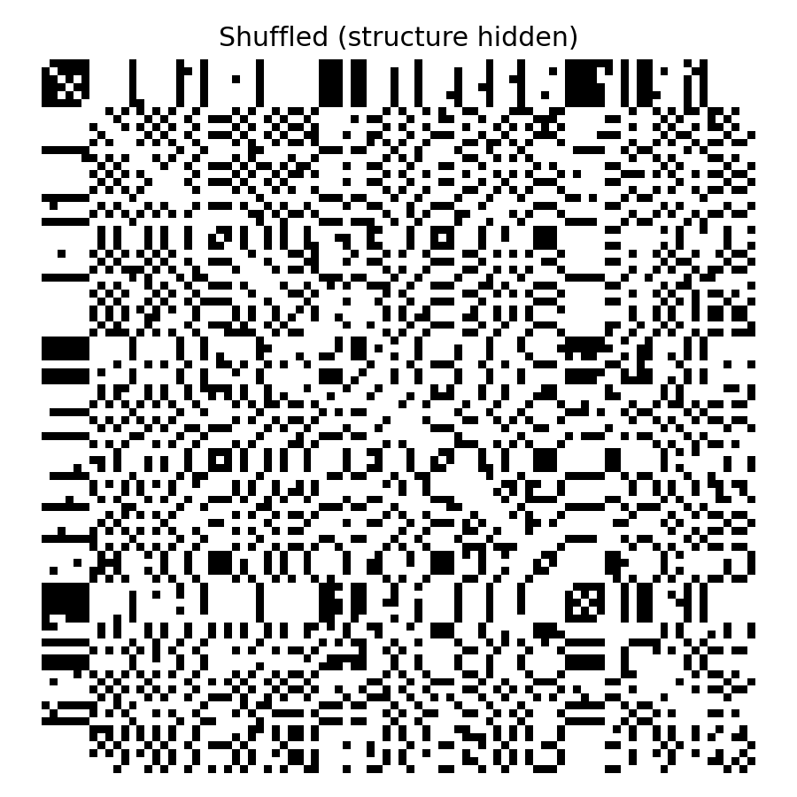
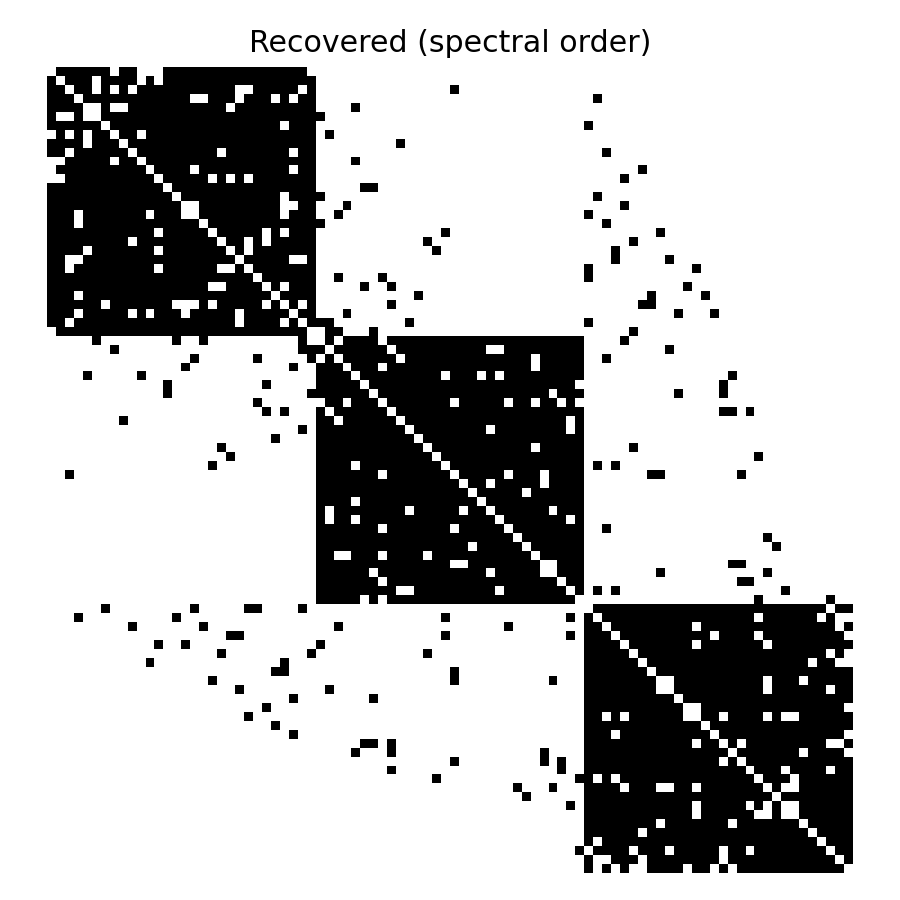

# SCOPE: Spectral Clustering for Optimized Pattern Estimation

[](https://www.python.org/downloads/)
[](https://opensource.org/licenses/MIT)
[](https://cupy.dev/)

A high-performance spectral clustering library that implements hierarchical graph clustering using spectral bisection with optional CPU pipeline and GPU acceleration.

## Features

- **Hierarchical Clustering**: Recursive spectral bisection to build binary tree structures
- **GPU Acceleration**: Optional CuPy/cupyx support for large-scale computations
- **Memory Efficient**: Automatic sparse matrix handling for large graphs
- **Parallel Processing**: Multi-threaded tree construction for faster execution
- **Comprehensive Testing**: Built-in benchmarking and visualization tools
- **Flexible Input**: Supports various matrix formats (NumPy, SciPy sparse, CuPy)

## Table of Contents

- [Installation](#installation)
- [Quick Start](#quick-start)
- [Core Algorithm](#core-algorithm)
- [Examples](#examples)
- [Performance](#performance)
- [API Reference](#api-reference)
- [File Structure](#file-structure)
- [Changelog](#changelog)
- [Contributing](#contributing)
- [License](#license)

## Installation

### Basic Installation

```bash
git clone https://github.com/your-username/spectral-clustering.git
cd spectral-clustering
pip install -r requirements.txt
```

### GPU Support (Optional)

For GPU acceleration, install CuPy for your CUDA version:

```bash
# For CUDA 11.x
pip install cupy-cuda11x

# For CUDA 12.x
pip install cupy-cuda12x

# For ROCm (AMD GPUs)
pip install cupy-rocm-5-0
```

### Requirements

- Python 3.7+
- NumPy
- SciPy
- Matplotlib
- CuPy (optional, for GPU support)

## Quick Start

### Basic Spectral Clustering

```python
from SCOPE import bicut_group, treebuilder
from graph_models import generate_test_laplacian

# Generate a test graph with two clusters
L = generate_test_laplacian(size1=50, size2=50, prob1=0.8, prob2=0.8, prob_between=0.1)

# Perform single bisection
group1, group2 = bicut_group(L)
print(f"Group 1: {len(group1)} nodes")
print(f"Group 2: {len(group2)} nodes")

# Build complete hierarchical tree
tree = treebuilder(L, thre=5)  # Stop recursion at 5 nodes
ordering = tree.get_order()
print(f"Node ordering: {ordering[:10]}...")  # Show first 10 nodes
```

### GPU Acceleration

```python
from SCOPE import bicut_group, treebuilder

# Use GPU for large graphs
L = generate_layers_groups_graph(
    num_supergroups=4,
    num_subgroups_per_supergroup=3,
    nodes_per_subgroup=20
)

# GPU-accelerated clustering
group1, group2 = bicut_group(L, gpueigen=True, gpucut=True, sparse=True)
tree = treebuilder(L, parallel=True)
```

### Visualization

```python
from graph_models import visualize_laplacian_matrix, combine_three_figures
from tests import test_duration_memory

# Test clustering recovery
duration, memory, ratio = test_duration_memory(L, show=True)
print(f"Recovery ratio: {ratio:.2%}")
```

### Generate Demo Images

To create the visual demonstration images shown above:

```bash
python scripts/demo_recovery.py
```

This will generate three images in the `figs/` directory showing the spectral clustering recovery process.

## Core Algorithm

SCOPE (Spectral Clustering fOr Pattern dEtection) implements a hierarchical spectral clustering algorithm:

1. **Spectral Bisection**: Use the Fiedler vector (second smallest eigenvector) to find optimal cuts
2. **Recursive Tree Building**: Apply bisection recursively to create a binary tree structure
3. **Adaptive Computation**: Automatically choose CPU/GPU and sparse/dense based on matrix properties
4. **Parallel Processing**: Use multi-threading for independent subtree construction

### Algorithm Pipeline

```
Input Graph → Laplacian Matrix → Fiedler Vector → Optimal Cut → Recursive Tree
     ↓              ↓                ↓              ↓              ↓
  Adjacency    L = D - A      Second Eigenvector  Best Cut Index  Binary Tree
```

### Visual Demonstration

The following images demonstrate how spectral clustering can recover hidden structure from shuffled data:

<div align="center">
  
  
  
</div>

<p align="center">
  <strong>Original</strong> → <strong>Shuffled</strong> → <strong>Recovered</strong><br>
  <em>Left: Clean block structure | Middle: Randomly shuffled (structure hidden) | Right: Recovered by Fiedler vector ordering</em>
</p>

## Examples

### 1. Two-Group Clustering

```python
from SCOPE import bicut_group
from graph_models import generate_test_laplacian

# Create a graph with two distinct clusters
L = generate_test_laplacian(
    size1=30, size2=30,      # Two groups of 30 nodes each
    prob1=0.9, prob2=0.9,    # High connectivity within groups
    prob_between=0.05        # Low connectivity between groups
)

# Find the optimal partition
group1, group2 = bicut_group(L)
print(f"Found {len(group1)} and {len(group2)} node clusters")
```

### 2. Hierarchical Multi-Level Clustering

```python
from SCOPE import treebuilder
from graph_models import generate_layers_groups_graph

# Create a hierarchical graph structure
L = generate_layers_groups_graph(
    num_supergroups=3,           # 3 top-level groups
    num_subgroups_per_supergroup=2,  # 2 subgroups each
    nodes_per_subgroup=10,       # 10 nodes per subgroup
    p_intra_subgroup=0.8,       # High within-subgroup connectivity
    p_intra_supergroup=0.3,     # Medium within-supergroup connectivity
    p_inter_supergroup=0.05     # Low between-supergroup connectivity
)

# Build complete hierarchical tree
tree = treebuilder(L, thre=3)  # Stop at 3 nodes minimum
tree.print_fancy_tree()        # Visualize the tree structure
```

### 3. Performance Testing

```python
from tests import test_duration_memory

# Test clustering performance
L = generate_layers_groups_graph(2, 3, 8, 0.8, 0.3, 0.05)
duration, memory, ratio = test_duration_memory(L, show=True)

print(f"Execution time: {duration:.3f}s")
print(f"Peak memory: {memory:.1f} MB")
print(f"Structure recovery: {ratio:.1%}")
```

### 4. Clustering Recovery Demonstration

```python
from tests import test_duration_memory
from graph_models import generate_layers_groups_graph

# Generate and test clustering recovery
L = generate_layers_groups_graph(2, 3, 8, 0.8, 0.3, 0.05)
duration, memory, ratio = test_duration_memory(L, show=True)

print(f"Execution time: {duration:.3f}s")
print(f"Peak memory: {memory:.1f} MB")
print(f"Structure recovery: {ratio:.1%}")
```

## Performance

- GPU acceleration with CuPy
- Sparse matrix support for large graphs
- Parallel tree construction

## API Reference

### Core Functions

- `bicut_group(L)`: Perform spectral bisection
- `treebuilder(L)`: Build hierarchical tree
- `eigen_decomposition(L)`: Compute Fiedler vector and eigenvalue
- `find_connected_components(L)`: Find connected components

For complete API documentation, see [docs/API.md](docs/API.md).

## File Structure

```
spectral-clustering/
├── SCOPE.py              # Core algorithms
├── graph_models.py       # Graph generation
├── tests.py              # Testing functions
├── docs/API.md           # API documentation
├── notebooks/demo.ipynb  # Demo notebook
└── scripts/              # Utility scripts
```

## Use Cases

- Community detection in networks
- Image segmentation
- Data clustering
- Graph structure analysis

## Advanced Usage

```python
from SCOPE import Pilot

# Performance tuning
manager = Pilot()
manager.set_gputhre(5000, 1000)  # GPU threshold
tree = treebuilder(L, manager=manager)
```

## Contributing

Contributions are welcome! Please feel free to submit a Pull Request. For major changes, please open an issue first to discuss what you would like to change.

1. Fork the repository
2. Create your feature branch (`git checkout -b feature/AmazingFeature`)
3. Commit your changes (`git commit -m 'Add some AmazingFeature'`)
4. Push to the branch (`git push origin feature/AmazingFeature`)
5. Open a Pull Request

## License

This project is licensed under the MIT License - see the [LICENSE](LICENSE) file for details.

## Acknowledgments

- Based on spectral clustering theory and Fiedler vector analysis
- GPU acceleration powered by CuPy
- Sparse matrix operations via SciPy
- Visualization using Matplotlib

## Support

If you encounter any issues or have questions:

1. Check the [API documentation](docs/API.md)
2. Look at the [examples](notebooks/demo.ipynb)
3. Open an issue on the repository

---

**Made for the spectral clustering community**